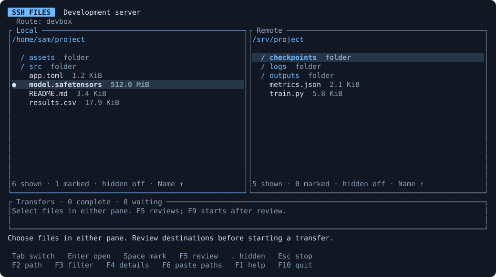
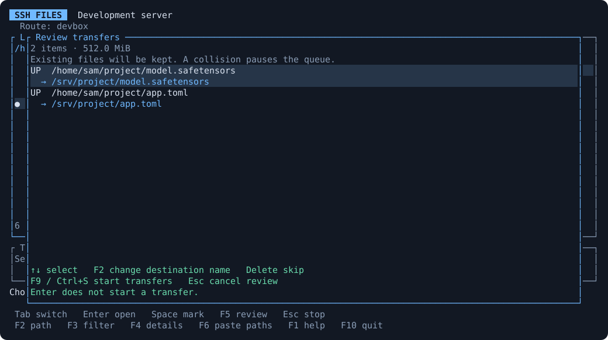

<p align="center"></p>

<h1 align="center">SSH Files</h1>
<p align="center"><strong>SFTP for the terminal you already use.</strong></p>

Browse both sides, select a batch with the keyboard or mouse, and queue the
transfer. Keep browsing while it runs. SSH Files uses your existing OpenSSH
aliases; SSH Sessions can supply its machine catalog and the route for this device.



*Rendered by the native application with example files and routes.*

> **Beta.** Windows and Linux transfer flows are tested with real OpenSSH.
> macOS builds and terminal checks run in CI; desktop use remains beta.

## What it does

- **Use the route you already have.** Your system `ssh` reads the alias and
  configuration, including a custom config file and `ProxyCommand`.
- **Move files in either direction.** Filter a pane, mark files or folders, and
  review every destination before starting. F6 accepts pasted local paths.
- **Keep browsing during a transfer.** The browser and serial transfer queue
  have separate SSH sessions on the same selected route.
- **Keep existing files.** A collision pauses the queue. Choose another name or
  skip it; a transfer never silently replaces the destination.
- **See interrupted work.** Details shows retained partials and any destination
  whose completion could not be confirmed. Transfers stop when Files closes.

## Install

> **0.3.0 prerelease.** The commands below use this version's compiled assets.
> Check [downloads and release status](https://github.com/brant92good/ssh-files/releases/tag/v0.3.0)
> for availability; [qualification results](docs/verification.md) record the checks.
> The previous verified release is [0.2.0](https://github.com/brant92good/ssh-files/tree/v0.2.0#install).

Windows PowerShell:

```powershell
irm https://raw.githubusercontent.com/brant92good/ssh-files/v0.3.0/install.ps1 | iex
```

Linux and macOS:

```sh
curl -fsSL https://raw.githubusercontent.com/brant92good/ssh-files/v0.3.0/install.sh | sh
```

The installer downloads a compiled binary, verifies its checksum, and adds the
command to your user PATH. No Rust, Python or Git is needed. Run the same command
to reinstall this version; unrelated files in the installation directory stay put.
Open a new terminal, then choose an alias that already works with `ssh`:

```sh
ssh-files --host devbox
```

To use a separate SSH config or start in particular directories:

```sh
ssh-files --host devbox --config ~/.ssh/work-config --local ~/project --remote /srv/project
```

Files needs SSH authentication that works without a prompt, such as a key already
usable by your system SSH or its agent. Connect with ordinary `ssh` to verify a
new host key first; a successful password login alone does not enable Files.
Upload finalization currently requires the OpenSSH SFTP hardlink extension
and hardlink support on the destination filesystem. [Connection details](docs/usage.md#connecting).

## The short keyboard guide

| Key | Action |
| --- | --- |
| Tab, arrows, Enter | Switch panes, select, open a folder |
| Type, F3 | Filter files; edit or clear the filter |
| Space | Mark or unmark an entry |
| Ctrl+A / Ctrl+Shift+A | Select the filtered list / clear marks |
| Ctrl+O | Cycle name and size sorting |
| Insert, then F9 | Create a folder in the selected pane |
| . | Show or hide hidden files when the filter is empty |
| F5 | Review selected uploads or downloads |
| F9 / Ctrl+S | Start the reviewed queue |
| F6 | Paste local paths for upload |
| Esc / Ctrl+C | Stop work; Ctrl+C also works inside a dialog |
| F10 / Ctrl+Q | Close Files; confirm when a queue is active |

You can also click to select, double-click to open a folder, and scroll the pane
under the pointer. Ctrl-click toggles a mark; Shift-click or dragging selects a
range. [Mouse controls and limits](docs/usage.md#browse-and-select).
The [feature inventory](docs/file-manager.md) spells out what is implemented and
where a shell or another file-transfer tool is still needed.



In the review, **F2** changes a destination name and **Delete** skips an item.
**Enter does not start a transfer.** [All controls and recovery behavior](docs/usage.md).

## Who might find it useful

People who work in a terminal but still want to see both sides before copying
builds, datasets, logs, or project files. It works as a standalone app. In
[SSH Sessions 0.8.0](https://github.com/brant92good/ssh-session-tui/releases/tag/v0.8.0),
run `ssh-sessions files` to choose a group, server and saved path, or press **X**
on a machine. Files receives the selected device route.

Use `scp` for a quick known-path copy, or `rsync` when you need synchronization
or resumable bulk transfers. SSH Files is for browsing and reviewing a batch
without rebuilding the connection in another app.

## Platforms and current checks

| Platform | Current qualification |
| --- | --- |
| Windows x64 | Compiled binary; real hidden ConPTY + OpenSSH transfer tests |
| Linux x64 / ARM64 | Compiled binaries; real PTY + OpenSSH transfer and shutdown tests |
| macOS Apple silicon / Intel | Compiled binaries and hosted terminal checks; **beta** |

The tests include actual file bytes, collisions, cancellation, host-key refusal,
explicit proxy routes, and a server reply lost after a successful finalization.
[Evidence and limits](docs/verification.md) separate observed checks from work
still pending. There is no native drag-out or transfer-resume feature. Terminal
file-drop behavior is unqualified; **F6 paste paths** is the supported input flow.

## Contributing

For source builds, install Rust 1.94.0 and run
`cargo +1.94.0 build --release --locked --bin ssh-files` in a clone of this repo.
The binary is `target/release/ssh-files` (`ssh-files.exe` on Windows).

Start with [the design and worker boundaries](docs/implementation.md). Run
`cargo +1.94.0 test --locked --all-targets` and
`cargo +1.94.0 clippy --locked --all-targets -- -D warnings`.
The Python scripts create disposable test servers; they are not app dependencies.
The transport probe is a developer binary and is excluded from release assets.

[MIT license](LICENSE) | [Dependency notices](docs/licenses/THIRD_PARTY_NOTICES.txt)
